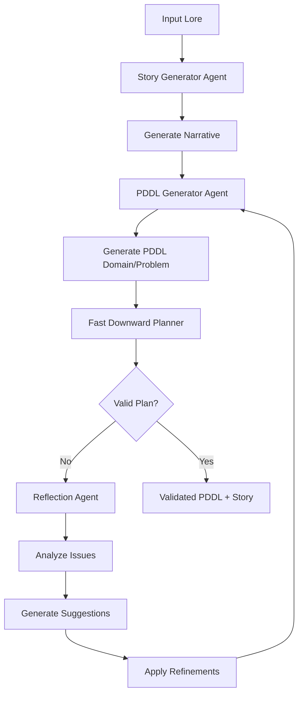
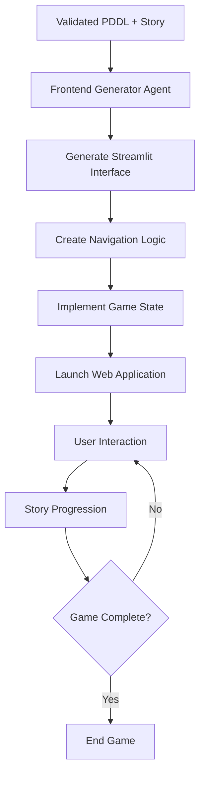

# QuestMaster AI - Relazione di Progetto

**Studente**: Umberto Domenico Ciccia, Salvatore Chiricosta, Giovanni Ferraro.
**Corso**: Intelligenza Artificiale  
**Anno Accademico**: 2024/2025  

---

## 📋 Indice

1. [Introduzione](#introduzione)
2. [Obiettivi del Progetto](#obiettivi-del-progetto)
3. [Architettura del Sistema](#architettura-del-sistema)
4. [Tecnologie Utilizzate](#tecnologie-utilizzate)
5. [Agenti AI Implementati](#agenti-ai-implementati)
6. [Flusso di Funzionamento](#flusso-di-funzionamento)
7. [Struttura del Progetto](#struttura-del-progetto)
8. [Installazione e Utilizzo](#installazione-e-utilizzo)
9. [Esempi Pratici](#esempi-pratici)
10. [Conclusioni e Sviluppi Futuri](#conclusioni-e-sviluppi-futuri)

---

## 1. Introduzione

**QuestMaster AI** è un sistema innovativo che combina l'intelligenza artificiale generativa con tecniche di pianificazione classica per creare esperienze narrative interattive. Il progetto rappresenta un'implementazione avanzata di un sistema multi-agente che utilizza PDDL (Planning Domain Definition Language) e Large Language Models (LLM) per generare automaticamente quest narrative logicamente consistenti e coinvolgenti.

Il sistema è stato progettato come un'applicazione a due fasi che assiste gli autori nella creazione di avventure interattive attraverso un processo automatizzato ma controllabile, garantendo sia la creatività narrativa che la coerenza logica dell'esperienza di gioco.

## 2. Obiettivi del Progetto

### Obiettivi Primari

- **Generazione Automatica di Narrative**: Creare storie coinvolgenti e coerenti utilizzando AI generativa
- **Validazione Logica**: Garantire che le quest generate siano logicamente risolvibili attraverso PDDL
- **Interfaccia Interattiva**: Fornire un'esperienza utente intuitiva e immersiva
- **Architettura Modulare**: Implementare un sistema facilmente estensibile e manutenibile

### Obiettivi Secondari

- **Containerizzazione**: Deployment semplificato attraverso Docker
- **CLI Completa**: Strumenti da riga di comando per sviluppatori
- **Logging Avanzato**: Sistema di monitoraggio e debugging completo
- **Validazione Continua**: Ciclo di raffinamento automatico per migliorare la qualità

## 3. Architettura del Sistema

### 3.1 Panoramica Architetturale

QuestMaster AI segue un'architettura multi-layered basata su agenti specializzati:

```
┌─────────────────────────────────────────────┐
│                UI Layer                     │
│  ┌─────────────┐  ┌─────────────────────┐   │
│  │ Streamlit   │  │   CLI Interface     │   │
│  │ Web App     │  │                     │   │
│  └─────────────┘  └─────────────────────┘   │
├─────────────────────────────────────────────┤
│              Agents Layer                   │
│  ┌─────────────┐  ┌─────────────────────┐   │
│  │   Story     │  │      PDDL           │   │
│  │ Generator   │  │   Generator         │   │
│  └─────────────┘  └─────────────────────┘   │
│  ┌─────────────┐  ┌─────────────────────┐   │
│  │ Reflection  │  │   Frontend          │   │
│  │   Agent     │  │   Generator         │   │
│  └─────────────┘  └─────────────────────┘   │
├─────────────────────────────────────────────┤
│             Services Layer                  │
│  ┌─────────────┐  ┌─────────────────────┐   │
│  │ LLM Service │  │  Planner Service    │   │
│  └─────────────┘  └─────────────────────┘   │
│  ┌─────────────┐  ┌─────────────────────┐   │
│  │File Service │  │   Validation        │   │
│  └─────────────┘  └─────────────────────┘   │
├─────────────────────────────────────────────┤
│               Core Layer                    │
│  ┌─────────────┐  ┌─────────────────────┐   │
│  │   Config    │  │     Logging         │   │
│  └─────────────┘  └─────────────────────┘   │
│  ┌─────────────┐  ┌─────────────────────┐   │
│  │ Exceptions  │  │      Models         │   │
│  └─────────────┘  └─────────────────────┘   │
└─────────────────────────────────────────────┘
```

### 3.2 Componenti Principali

#### **Core Components**
- **Configuration Management**: Gestione centralizzata delle configurazioni
- **Logging System**: Sistema di logging strutturato con Rich e Structlog
- **Exception Handling**: Gestione degli errori specializzata per dominio
- **Data Models**: Modelli Pydantic per validazione e serializzazione

#### **Services Layer**
- **LLM Service**: Interfaccia con OpenAI GPT per generazione di contenuti
- **Planner Service**: Integrazione con Fast Downward planner
- **File Service**: Gestione I/O di file e persistenza
- **Validation Service**: Validazione di PDDL e narrative

## 4. Tecnologie Utilizzate

### 4.1 Linguaggi e Framework Core

- **Python 3.9+**: Linguaggio principale del progetto
- **Pydantic 2.0+**: Validazione e serializzazione dati
- **Streamlit 1.28+**: Framework per interfaccia web
- **Click 8.0+**: Framework per CLI

### 4.2 AI e Machine Learning

- **OpenAI API 1.0+**: Large Language Models (GPT-4o-mini)
- **Fast Downward**: Classical planner per PDDL
- **PDDL**: Planning Domain Definition Language

### 4.3 Containerizzazione e Deployment

- **Docker**: Containerizzazione dell'applicazione
- **Docker Compose**: Orchestrazione multi-container
- **Shell Scripting**: Automazione setup e deployment

### 4.4 Development Tools

- **pytest**: Testing framework
- **Black**: Code formatting
- **Ruff**: Linting veloce
- **mypy**: Type checking
- **Rich**: Output colorato e formattato
- **Tenacity**: Retry logic per API calls

### 4.5 Librerie di Supporto

- **structlog**: Logging strutturato
- **pathvalidate**: Validazione percorsi file
- **pytest-cov**: Coverage testing
- **pytest-asyncio**: Testing asincrono

## 5. Agenti AI Implementati

### 5.1 Story Generator Agent

**Responsabilità**: Generazione narrativa principale

**Caratteristiche**:
- Creazione di lore dettagliato con personaggi, ambientazioni e trama
- Integrazione con template JSON per struttura consistente
- Generazione di elementi narrativi ricchi e coinvolgenti
- Adattamento a vincoli di branching factor e profondità

**Implementazione**:
```python
class StoryGeneratorAgent:
    def generate_story(self, lore_input: str) -> Lore:
        # Utilizza LLM per generare narrative strutturate
        # Valida la coerenza narrativa
        # Restituisce oggetto Lore validato
```

### 5.2 PDDL Generator Agent

**Responsabilità**: Conversione narrative in modelli di pianificazione

**Caratteristiche**:
- Traduzione di storie in domini e problemi PDDL
- Generazione di azioni, predicati e condizioni goal
- Commenti esplicativi per ogni elemento PDDL
- Ottimizzazione per solvibilità

**Elementi PDDL Generati**:
- **Domini**: Definizione azioni, predicati, tipi
- **Problemi**: Stato iniziale, oggetti, goal
- **Azioni**: move, collect_item, overcome_obstacle, complete_quest

### 5.3 Reflection Agent

**Responsabilità**: Validazione e raffinamento iterativo

**Caratteristiche**:
- Analisi di inconsistenze logiche in PDDL
- Suggerimenti di miglioramento automatici
- Ciclo di raffinamento iterativo
- Interazione con utente per approvazione modifiche

**Processo di Riflessione**:
1. Analisi del PDDL generato
2. Identificazione problemi di solvibilità
3. Generazione suggerimenti specifici
4. Implementazione modifiche approvate

### 5.4 Frontend Generator Agent

**Responsabilità**: Creazione interfacce interattive

**Caratteristiche**:
- Generazione di interfacce Streamlit dinamiche
- Adattamento UI ai requisiti della storia
- Integrazione con sistema di navigazione
- Componenti interattivi personalizzati

## 6. Flusso di Funzionamento

### 6.1 Phase 1: Story Generation e PDDL Validation



**Dettaglio del Processo**:

1. **Input Processing**: Lettura del file lore iniziale
2. **Story Generation**: StoryGeneratorAgent crea narrative dettagliate
3. **PDDL Translation**: PDDLGeneratorAgent converte in formato pianificazione
4. **Validation**: Fast Downward verifica solvibilità
5. **Refinement Loop**: ReflectionAgent migliora iterativamente se necessario
6. **Output**: PDDL validato e storia finalizzata

### 6.2 Phase 2: Interactive Story Game



**Componenti Generati**:
- Interfaccia web Streamlit personalizzata
- Sistema di navigazione basato su stati
- Gestione delle scelte utente
- Visualizzazione progressiva della storia

### 6.3 Ciclo di Raffinamento

Il sistema implementa un ciclo di raffinamento automatico per garantire qualità:

1. **Detection**: Identificazione automatica di problemi
2. **Analysis**: Analisi approfondita delle cause
3. **Suggestion**: Generazione di soluzioni specifiche
4. **Validation**: Test delle modifiche proposte
5. **Integration**: Applicazione delle modifiche approvate

## 7. Struttura del Progetto

### 7.1 Organizzazione Directory

```
QuestMasterAI/
├── src/questmaster/           # Codice sorgente principale
│   ├── __init__.py           # Package initialization
│   ├── app.py                # Applicazione principale
│   ├── cli.py                # Interfaccia command-line
│   ├── agents/               # Agenti AI specializzati
│   │   ├── __init__.py
│   │   ├── story_generator.py
│   │   ├── pddl_generator.py
│   │   ├── reflection.py
│   │   └── frontend_generator.py
│   ├── core/                 # Componenti core
│   │   ├── __init__.py
│   │   ├── config.py         # Configurazione sistema
│   │   ├── logging.py        # Sistema logging
│   │   └── exceptions.py     # Eccezioni custom
│   ├── models/               # Modelli dati
│   │   ├── __init__.py
│   │   ├── lore.py
│   │   └── validation.py
│   ├── services/             # Servizi business logic
│   │   ├── __init__.py
│   │   ├── llm_service.py
│   │   ├── planner_service.py
│   │   └── file_service.py
│   ├── ui/                   # Componenti interfaccia
│   └── utils/                # Utilità generiche
├── data/                     # Dati del progetto
│   ├── domain.pddl           # Dominio PDDL generato
│   ├── problem.pddl          # Problema PDDL generato
│   ├── lore.json            # File lore principale
│   └── story.json           # Storia generata
├── resources/                # Risorse e template
│   ├── ASSIGNMENT.md         # Specifiche progetto
│   ├── lore_template.json   # Template lore
│   └── example_frontend.py  # Esempio frontend
├── fast-downward-24.06.1/   # Classical planner
├── docker-compose.yml       # Configurazione Docker
├── Dockerfile              # Immagine Docker
├── pyproject.toml          # Configurazione progetto Python
├── requirements.txt        # Dipendenze Python
└── README.md              # Documentazione principale
```

### 7.2 Moduli Chiave

#### **app.py** - Applicazione Principale
```python
class QuestMasterApp:
    def __init__(self, api_key: Optional[str] = None):
        # Inizializzazione servizi e agenti
        
    def run_phase1(self, lore_path: Optional[str] = None) -> ValidationResult:
        # Esecuzione Phase 1: Story Generation
        
    def run_phase2(self) -> None:
        # Esecuzione Phase 2: Interactive Game
```

#### **cli.py** - Interfaccia Command Line
- Comando `phase1`: Esecuzione generazione storia
- Comando `phase2`: Avvio gioco interattivo  
- Comando `run`: Esecuzione completa pipeline
- Opzioni configurazione: log-level, debug, api-key

## 8. Installazione e Utilizzo

### 8.1 Prerequisiti

- **Python 3.9+**
- **Docker** (opzionale ma raccomandato)
- **OpenAI API Key**
- **Sistema Unix-like** (macOS/Linux)

### 8.2 Installazione con Docker (Raccomandato)

```bash
# Clone del repository
git clone https://github.com/umbertocicciaa/QuestMasterAI.git
cd QuestMasterAI

# Setup automatico con Docker
./docker-setup.sh

# Oppure manualmente
docker-compose up --build
```

**Accesso all'applicazione**:
- Web Interface: http://localhost:8501
- Logs: `docker-compose logs -f questmaster`

### 8.3 Installazione Locale

```bash
# Setup ambiente virtuale
python -m venv venv
source venv/bin/activate  # su Windows: venv\Scripts\activate

# Installazione dipendenze
pip install -e .

# Setup Fast Downward
./start.sh

# Configurazione API Key
export OPENAI_API_KEY="your-api-key-here"
```

### 8.4 Utilizzo CLI

#### **Esecuzione Completa**
```bash
python -m questmaster.cli run
```

#### **Esecuzione per Fasi**
```bash
# Phase 1: Story Generation
python -m questmaster.cli phase1 --lore-path data/lore.json

# Phase 2: Interactive Frontend  
python -m questmaster.cli phase2
```

#### **Opzioni Avanzate**
```bash
# Debug mode
python -m questmaster.cli --debug --log-level DEBUG phase1

# Custom API key
python -m questmaster.cli --api-key "sk-custom-key" run

# Help
python -m questmaster.cli --help
```

### 8.5 Configurazione Ambiente

#### **Variabili Ambiente**
```bash
export OPENAI_API_KEY="sk-your-openai-key"
export CHATGPT_MODEL="gpt-4o-mini-2024-07-18"
export LOG_LEVEL="INFO"
export DEBUG="False"
export FAST_DOWNWARD_TIMEOUT="300"
```

#### **File di Configurazione**
Le configurazioni sono gestite tramite `pyproject.toml` e il sistema di settings di Pydantic.

## 9. Esempi Pratici

### 9.1 Esempio di Lore Input

```json
{
  "start": {
    "text": "Ti risvegli in un mondo incantato, su una spiaggia deserta...",
    "actions": {
      "Esplora la capanna": "hut",
      "Avventurati verso la grotta": "cave"
    }
  },
  "hut": {
    "text": "La capanna è avvolta dal silenzio...",
    "actions": {
      "Segui la mappa verso la grotta": "cave"
    }
  }
}
```

### 9.2 PDDL Generato

#### **Domain File**
```pddl
(define (domain legacy-quest)
  (:requirements :strips :typing)
  (:types character location item obstacle)
  
  (:predicates
    (at ?c - character ?loc - location) ; Character is at location
    (has_item ?c - character ?item - item) ; Character has item
    (quest_completed) ; Quest completion state
  )
  
  (:action move
    :parameters (?c - character ?from - location ?to - location)
    :precondition (at ?c ?from)
    :effect (and (not (at ?c ?from)) (at ?c ?to))
  )
)
```

#### **Problem File**
```pddl
(define (problem legacy-quest-scenario)
  (:domain legacy-quest)
  
  (:objects
    hero - character
    village forest cave - location
    sword shield quest_item - item
    dragon - obstacle
  )
  
  (:init
    (at hero village)
  )
  
  (:goal (quest_completed))
)
```

### 9.3 Output del Sistema

#### **Phase 1 Output**
```
🚀 Starting Phase 1: Story Generation
✅ Phase 1 completed successfully!
Execution time: 45.23s
Plan length: 8 steps
```

#### **Plan Generato**
```
1. move hero village forest
2. collect_item hero sword forest  
3. overcome_obstacle hero dragon forest
4. move hero forest cave
5. collect_item hero quest_item cave
6. complete_quest hero
```

### 9.4 Interfaccia Web Generata

Il sistema genera automaticamente un'interfaccia Streamlit che include:

- **Navigation Panel**: Controlli per muoversi nella storia
- **Story Display**: Visualizzazione testuale dell'avventura
- **Action Buttons**: Bottoni per le scelte disponibili
- **State Tracking**: Monitoraggio del progresso
- **Rich Formatting**: Stile e formattazione accattivanti

## 10. Conclusioni e Sviluppi Futuri

### 10.1 Risultati Raggiunti

Il progetto QuestMasterAI ha raggiunto con successo gli obiettivi prefissati:

#### **Obiettivi Tecnici**
- ✅ **Architettura Multi-Agente**: Sistema modulare e estensibile
- ✅ **Integrazione PDDL**: Validazione logica attraverso classical planning
- ✅ **Pipeline Automatizzata**: Processo end-to-end completamente automatico
- ✅ **Interfaccia Moderna**: UI web intuitiva e responsive
- ✅ **Containerizzazione**: Deployment semplificato con Docker

#### **Obiettivi di Qualità**
- ✅ **Robustezza**: Gestione errori e recovery automatico
- ✅ **Scalabilità**: Architettura predisposta per estensioni
- ✅ **Manutenibilità**: Codice ben strutturato e documentato
- ✅ **Testing**: Suite di test automatizzati
- ✅ **Logging**: Sistema di monitoraggio completo

### 10.2 Innovazioni Introdotte

#### **Integrazione AI Generativa + Classical Planning**
L'aspetto più innovativo del progetto è l'integrazione seamless tra:
- **LLM per creatività**: Generazione di narrative coinvolgenti
- **PDDL per logica**: Garanzia di coerenza e solvibilità
- **Ciclo di raffinamento**: Miglioramento iterativo automatico

#### **Sistema Multi-Agente Specializzato**
Ogni agente ha responsabilità specifiche:
- **Separazione delle responsabilità**: Maggiore manutenibilità
- **Specializzazione**: Ottimizzazione per task specifici  
- **Coordinazione**: Collaborazione efficace tra agenti

#### **Validation-Driven Development**
- **Feedback immediato**: Validazione continua della qualità
- **Auto-correzione**: Capacità di auto-miglioramento
- **Garanzie formali**: Uso di classical planning per verifica

### 10.3 Limitazioni Attuali

#### **Limitazioni Tecniche**
- **Dipendenza da API esterne**: Richiede connessione internet e API key
- **Tempo di elaborazione**: Generazione può richiedere diversi minuti
- **Complessità PDDL**: Limitato a domini relativamente semplici
- **Lingua**: Attualmente ottimizzato principalmente per italiano

#### **Limitazioni Funzionali**
- **Personalizzazione limitata**: Template predefiniti per la struttura
- **Interazione utente**: Interfaccia principalmente read-only in Phase 2
- **Multimedia**: Supporto limitato per immagini e audio
- **Persistenza**: Stato di gioco non persiste tra sessioni

### 10.4 Sviluppi Futuri

#### **Miglioramenti a Breve Termine**

**Enhanced User Interaction**
```python
# Implementazione di feedback loop utente
class InteractiveRefinement:
    def get_user_feedback(self, suggestions: List[str]) -> UserFeedback:
        # Chat interface per approvazione modifiche
        
    def apply_user_preferences(self, preferences: UserPreferences):
        # Personalizzazione basata su preferenze utente
```

**Multi-language Support**
- Estensione a inglese, francese, spagnolo
- Template localizzati per diverse culture narrative
- Agenti specializzati per stili narrativi regionali

**Advanced PDDL Features**
- Supporto per temporal planning
- Conditional effects e derived predicates
- Optimization objectives per qualità narrativa

#### **Miglioramenti a Medio Termine**

**Visual Story Generation**
- Integrazione con DALL-E per generazione immagini
- Interfaccia grafica avanzata con Streamlit
- Supporto per mappe interattive

**Persistent Game State**
- Database per salvataggio progressi
- Sistema di account utente
- Multiplayer collaborative stories

**Advanced AI Agents**
- Character development agent per personaggi dinamici
- Dialogue generation agent per conversazioni
- Emotion tracking agent per coinvolgimento emotivo

#### **Visione a Lungo Termine**

**Educational Platform**
- Integrazione in ambienti educativi
- Strumenti per insegnanti
- Analytics per apprendimento

**Commercial Applications**
- Sistema di authoring per game designer
- Template marketplace
- API per integrazione in giochi esistenti

**Research Contributions**
- Pubblicazioni scientifiche su AI + Planning
- Benchmark per narrative generation
- Open source community development

### 10.5 Impatto e Valore del Progetto

#### **Valore Accademico**
- **Ricerca Innovativa**: Combinazione unica di tecnologie
- **Contributo Scientifico**: Metodologia riproducibile
- **Formazione**: Esempio pratico di sistemi AI complessi

#### **Valore Pratico**
- **Strumento Reale**: Utilizzabile per creazione contenuti
- **Framework Estensibile**: Base per progetti futuri
- **Best Practices**: Esempio di sviluppo software moderno

#### **Valore Sociale**
- **Democratizzazione**: Accessibilità alla creazione narrativa
- **Educazione**: Strumento per apprendimento interattivo
- **Creatività**: Amplificazione delle capacità creative umane

---

## 📚 Bibliografia e Riferimenti

- **OpenAI API Documentation**: Utilizzo di Large Language Models
- **PDDL Documentation**: Planning Domain Definition Language
- **Fast Downward**: Classical Planning System
- **Streamlit Documentation**: Framework per interfacce web
- **Pydantic**: Data validation e settings management
- **Docker**: Containerizzazione e deployment

---

## 🔗 Repository e Risorse

- **GitHub Repository**: [QuestMasterAI](https://github.com/umbertocicciaa/QuestMasterAI)
- **Documentation**: Documentazione completa nel README.md
- **Issues**: Sistema di tracking per bug e feature requests
- **Examples**: Esempi e template nella cartella `resources/`

---

*Questa relazione documenta lo sviluppo e l'implementazione di QuestMasterAI, un sistema innovativo che dimostra le potenzialità dell'integrazione tra AI generativa e classical planning per la creazione di esperienze narrative interattive di alta qualità.*
